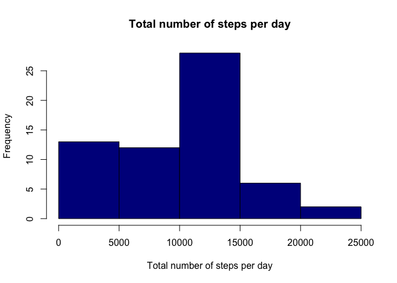
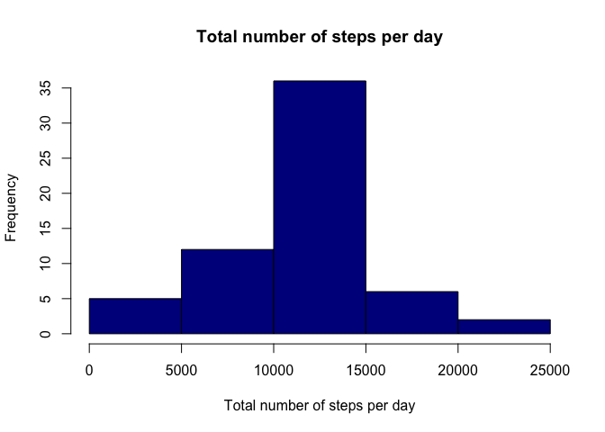

Loading the data and exploring the basics

``` r
setwd("/Users/connect/Documents/GitHub/RepData_PeerAssessment1")
activity <- read.csv("activity.csv")
library(lubridate)
```

    ## 
    ## Attaching package: 'lubridate'

    ## The following object is masked from 'package:base':
    ## 
    ##     date

``` r
activity$date<-ymd(activity$date)
```

Question 2: histogram of total number of steps each day

``` r
steptot <- data.frame(tapply(activity$steps, activity$date, sum, na.rm=TRUE))
steptot$date <- rownames(steptot)
rownames(steptot) <- NULL
names(steptot)[[1]] <- "total"
hist(steptot$total,
     main = "Total number of steps per day",
     xlab = "Total number of steps per day",
     col = "darkblue")
```



Mean of total number of steps per day

``` r
mean(steptot$total)
```

    ## [1] 9354.23

Median of total number of steps per day

``` r
mean(steptot$total)
```

    ## [1] 9354.23

Question 3: Average daily activity pattern

``` r
stepavg <- aggregate(activity$steps, by=list(activity$interval),
                     FUN=mean, na.rm=TRUE)
names(stepavg) <- c("interval", "mean")
plot(stepavg$interval, stepavg$mean, 
     type = "l", col="darkblue", 
     lwd = 2,
     xlab="Interval", 
     ylab="Average number of steps", 
     main="Average number of steps per intervals")
```


Which 5-minute interval, on average across all the days in the dataset, contains the maximum number of steps?

``` r
stepavg[which.max(stepavg$mean), ]$interval
```

    ## [1] 835

How to impute missing values? Calculate and report the total number of missing values in the dataset

``` r
sum(is.na(activity$steps))
```

    ## [1] 2304

Devise a strategy for filling in all of the missing values in the dataset.

``` r
missing <- stepavg$mean[match(activity$interval, stepavg$interval)]
```

Create new dataset with missing values filled in

``` r
nactivity <- transform(activity, 
                       steps = ifelse(is.na(activity$steps),
                                             yes = missing,
                                             no = activity$steps))
ntotalstep <- aggregate(steps ~ date,
                        nactivity,
                        sum)
names(ntotalstep) <- c("date","dailystep")
```

New histogram

``` r
hist(ntotalstep$dailystep,
     main = "Total number of steps per day",
     xlab = "Total number of steps per day",
     col = "darkblue")
```



Mean of total number of steps per day

``` r
mean(ntotalstep$dailystep)
```

    ## [1] 10766.19

Median of total number of steps per day

``` r
median(ntotalstep$dailystep)
```

    ## [1] 10766.19

Difference in activity pattern between weekday and weekend Create a new factor variable in the dataset with two levels – “weekday” and “weekend” indicating whether a given date is a weekday or weekend day.

``` r
activity$date <- as.Date(strptime(activity$date, format="%Y-%m-%d"))
activity$day <- sapply(activity$date, function(x) {
  if (weekdays(x) == "Sunday" | weekdays(x) == "Saturday")
  {y <- "Weekend"} else
  {y <- "Weekday"}
  y
})
```

New panel plot of weekday vs weekend

``` r
activityday <- aggregate(steps ~ interval + day,
                         activity,
                         FUN=mean,
                         na.rm = TRUE)
library(ggplot2)
ggplot(activityday, aes(x = interval, y = steps, color = day)) +
  geom_line() +
  labs(title = "Average daily steps by weekday/weekend", 
       x = "Interval", 
       y = "Average number of steps") +
  facet_wrap(~day, ncol = 1, nrow=2)
```


``` r
ggsave("weekday.png")
```

    ## Saving 7 x 5 in image
